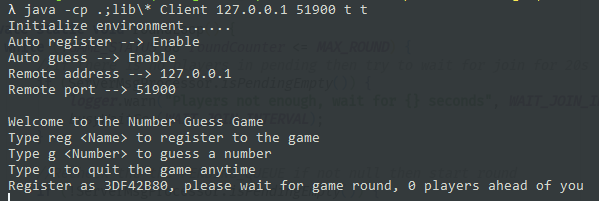
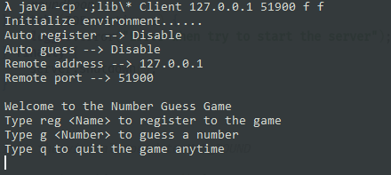
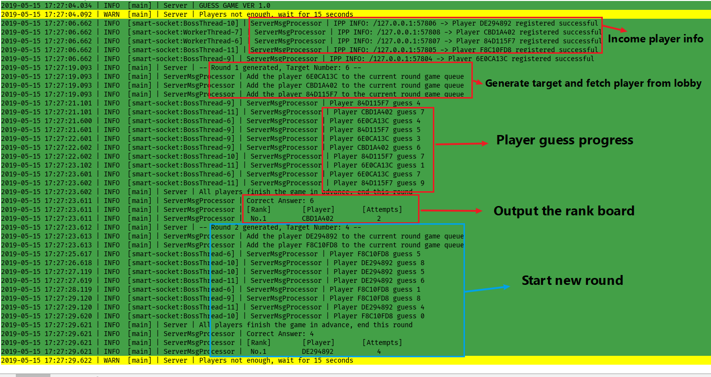
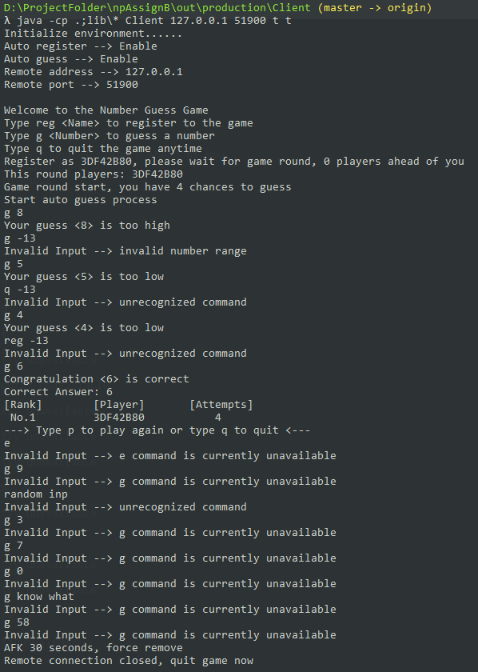
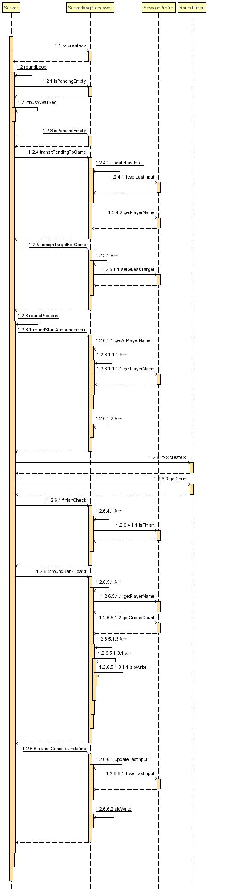
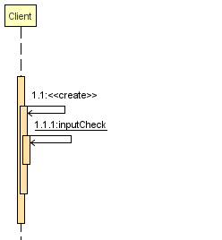
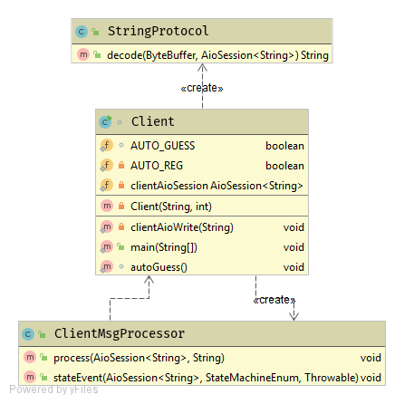
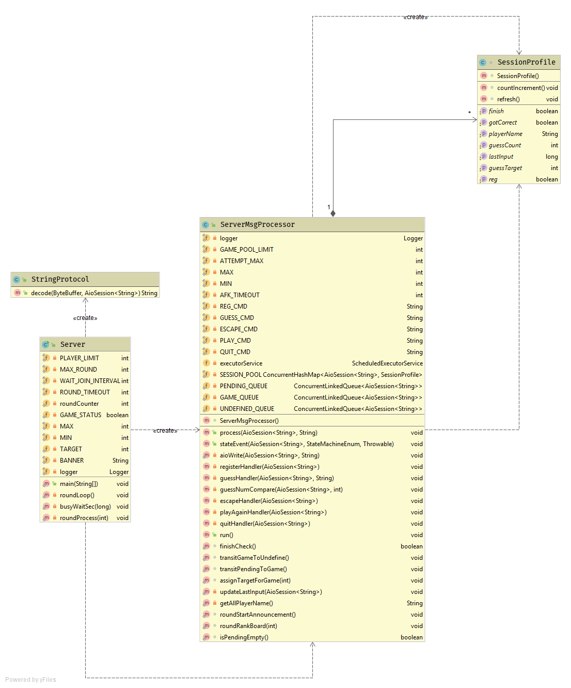
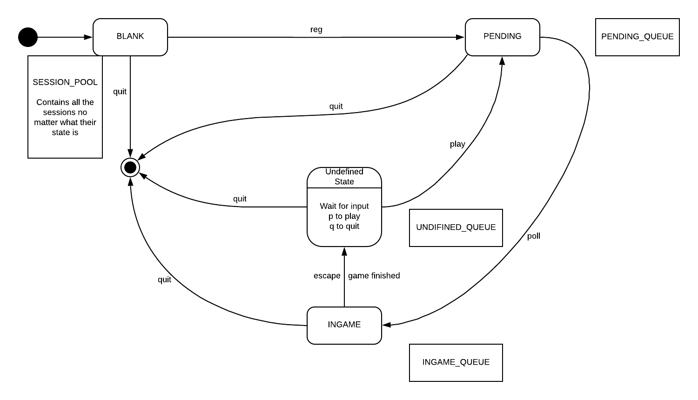

# COSC1176/1179 – Network Programming (NP) Assignment (2019 Semester 1)

## Guess Game Multiplayer Version Manual Document

### Build & Run
#### Server  
``javac -cp .:lib/* *.java``  
``java -cp .:lib/* Server``  

#### Client     
``javac -cp .:lib/* *.java``  
``java -cp .:lib/* Client <host> <port> <autoReg> <autoGuess>`` 

#### Options  
``java -cp .;lib\* Client 127.0.0.1 51900 t t``  
Connect to 127.0.0.1:51900 with auto register auto guess both enable  
  

``java -cp .;lib\* Client 127.0.0.1 51900 f f``  
Connect to 127.0.0.1:51900 with auto register auto guess both disable  
  

**Tips**: Replace ``:`` with ``;`` and ``/`` with ``\`` in windows  

### Check port
Run ``netstat -an|grep tcp|grep :`` replace ``:`` with ``port`` to check if the port is occupied or not  

### Game Rules
- Server will generate a number range of 0-9 every round.
- Server limit 3 registered players to play at the same time.
- Player has 4 chances to guess, clue will be given if guess the wrong answer.
- Each round has a 35 seconds time limit.
- Client has a 30 seconds AFK time limit while not in the pending status.
- If the round reachs the limit or all players finish the guess(get the correct answer or use out of the tries), the server will broadcast the rank info to every player(players who didn't get the correct answer will not be in the rank).
- After rank output, players will be asked to choose to play again or quit the game.

### Commands
**Register**  
Use ``reg`` to register, a random name will be assigned as your player name which is generated by server.  
This command is only available when you just connect to the game server.  

**Guess**  
Use ``g <num>`` to guess a number(num should falls in range of 0-9).  
This command is only available when you are in a active guess round.  

**Escape**  
Use ``e`` to escape to quit the current guess round.  
This command is only available when you are in a acitve guess round.  

**Play Again**  
Use ``p`` to play a new guess round, you will be added to the end of the pending queue, you need to wait for being added to the new guess round.  
This command is only available when you escape from a guess round or finished a guess round.  

**Quit**  
Use ``q`` to quit the game anytime, you will be disconnected from the server and quit the game entirely.  
This command is available at anytime.  

### Running Screenshot
#### Server Side  
  

#### Client Side  
  

### Diagrams
#### C/S Sequence Diagram
  

#### Server Sequence Diagram
  

#### Client Sequence Diagram
  

#### Client Class Diagram  
  

#### Server Class Diagram  
  

#### Session State Diagram
  

### Credit
#### Projects

* [smart-socket](https://github.com/smartboot/smart-socket): The socket communication implementation is based on this
 framework, for the excellent work done by [三刀](https://gitee.com/qsyjcsxdl)
 